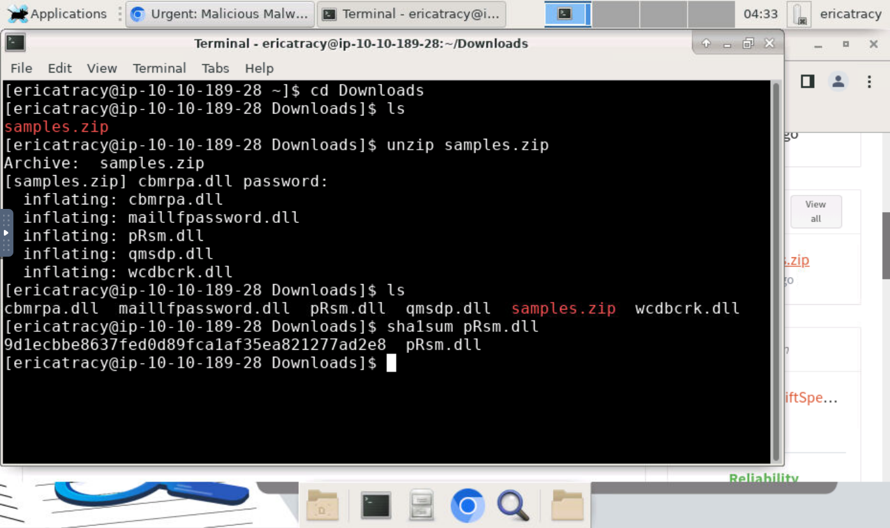
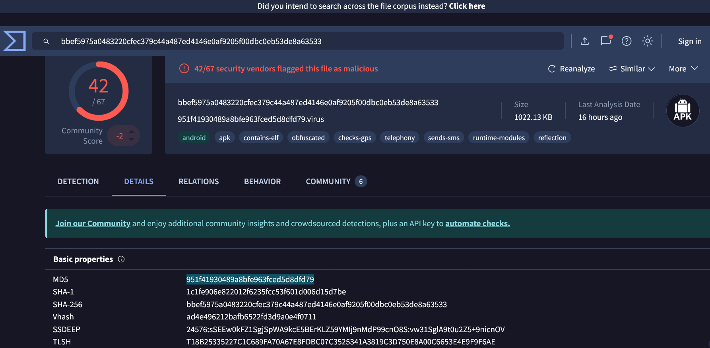
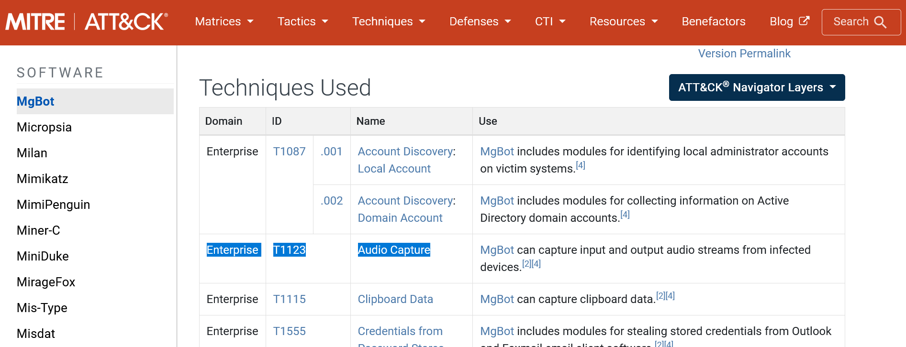
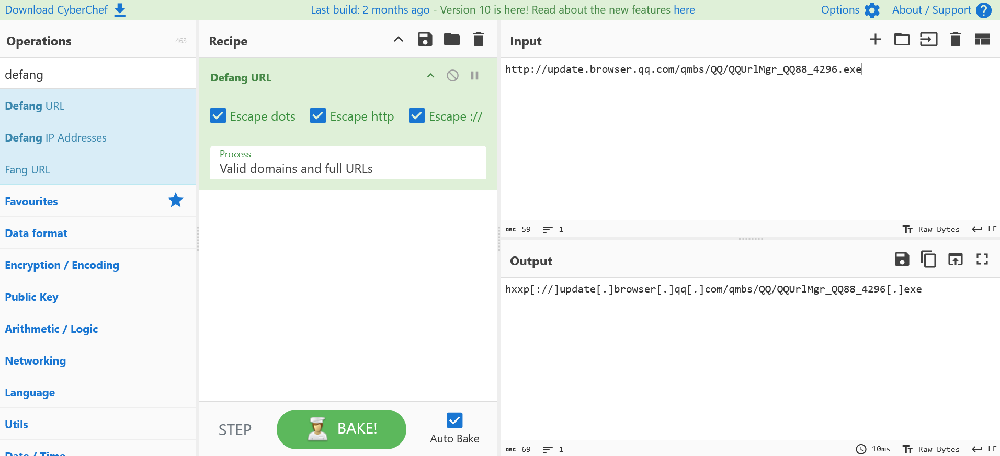

# Incident Response and Malware Analysis: Uncovering the "pRsm.dll" Malware Threat in Financial Sector

## Objective
This project involved a detailed analysis of a cybersecurity incident in the financial sector. The focus was on detecting and investigating a malware attack, identifying malicious files, examining their behavior, and implementing mitigation strategies to neutralize the threat.

## Skills Utilized
- **Malware Analysis**: Extracted file hashes, examined malicious behavior, and identified associated malware frameworks.  
- **Incident Response**: Applied a structured methodology from initial detection through remediation.  
- **Threat Intelligence**: Used OSINT and correlated findings with global intelligence databases.  
- **Tool Proficiency**: Worked with CyberChef, VirusTotal, and the MITRE ATT&CK framework.  

## Tools Used
- **Virtual Machine (VM)**: Provided an isolated environment for safe malware analysis.  
- **CyberChef**: Defanged malicious URLs and IP addresses for safe handling.  
- **VirusTotal**: Verified file hashes and gathered intelligence on malware samples.  
- **MITRE ATT&CK Framework**: Mapped malicious behavior to tactics, techniques, and procedures (TTPs).  
- **DocIntel Platform**: Organized incident details and supporting evidence.  

## Steps Taken
1. **Scenario Setup**: Initiated the investigation within a secure virtual machine (VM) environment and accessed the necessary files and tools through the DocIntel platform.

2. **File Hashing**: Generated a SHA1 hash for the suspicious "pRsm.dll" file extracted from the archive to establish a unique digital fingerprint for further analysis.  
     

3. **Malware Identification**: Submitted the hash to VirusTotal, which confirmed the file’s association with a known malware family and provided additional intelligence on related modules.  
     

4. **MITRE ATT&CK Mapping**: Correlated the malware’s observed behaviors with MITRE ATT&CK techniques, offering insight into the tactics, techniques, and procedures (TTPs) leveraged by the threat actors.  
     

5. **URL and IP Defanging**: Applied CyberChef to safely defang command-and-control (C2) URLs and IP addresses linked to the malware, ensuring they could be studied without risk of accidental activation.  
     

6. **Further Research**: Conducted in-depth research into the malware’s capabilities and its potential ties to advanced persistent threat (APT) groups. Insights were supported by an ESET report on the Evasive Panda APT group, recognized for deploying sophisticated malware against high-profile targets. This analysis offered critical context on the malware’s functionality and its role in broader cyber-espionage operations. 
  
## Supporting Evidence
The investigation combined hands-on analysis in the VM with external threat intelligence. Screenshots captured during hashing, VirusTotal queries, and CyberChef operations provided visual evidence of the workflow. The ESET WeLiveSecurity report on Evasive Panda was especially valuable in contextualizing the malware’s broader role in advanced persistent threat activity. 

## Learning Outcomes
- Executed a full malware analysis workflow within an isolated VM.  
- Extracted and validated file hashes against global threat intelligence platforms.  
- Practiced safe handling of IoCs by defanging malicious URLs and IPs.  
- Applied MITRE ATT&CK framework to classify malware techniques and behaviors.  
- Strengthened incident response methodology from detection through remediation.  
- Researched and contextualized APT-linked malware activity using OSINT.  

## Conclusion
This project demonstrated the value of a structured, intelligence-driven approach to incident response. By combining malware analysis techniques with established frameworks such as MITRE ATT&CK, I successfully identified and contextualized a high-risk security threat. The exercise reinforced the importance of continuous learning and the use of specialized tools in defending against evolving cyber threats.

**Reference:**  
ESET (2023, April 26). *Evasive Panda APT group updates malware through popular Chinese software.* [WeLiveSecurity](https://www.welivesecurity.com/2023/04/26/evasive-panda-apt-group-malware-updates-popular-chinese-software/). 

---
### Author
Olusegun Soares – Cybersecurity Enthusiast  
[LinkedIn Profile](https://www.linkedin.com/in/olusegun-soares-59862582/) | [GitHub Profile](https://github.com/olusegunsoares)
